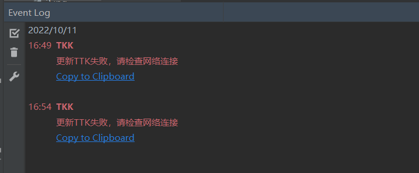
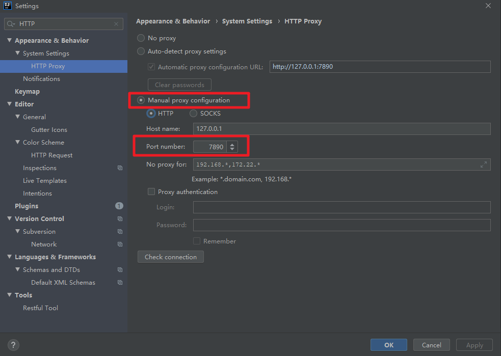
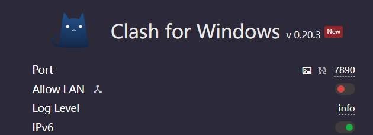
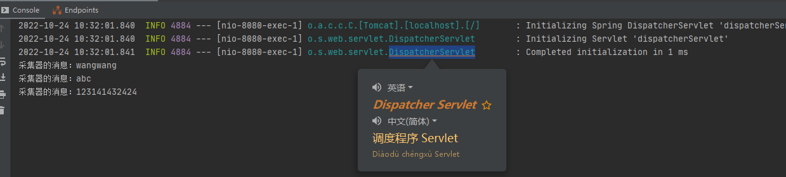

# 【IDEA】Translate插件无法使用的情况

## 【原因】

美国谷歌公司星期一(10月3日)宣布，因使用率低而终止了在中国大陆的谷歌翻译服务。这标志着谷歌这一美国科技巨头又一次从中国大陆市场撤除仅存的少数服务之一，也是美国因特网公司近年由于中国国内竞争、更强硬的管制和严厉的审查机制，在中国市场经营愈发艰难，被迫广泛撤离中国的最新动作。

华尔街日报报道，谷歌公司发言人说，翻译的手机软件及浏览器版本已经停止在中国的服务。网络版的谷歌翻译将用户导向谷歌翻译的香港版本，但是，在中国大陆用户除翻墙外，无法进入香港的这个网站。

## 【结果】

## 【解决方法】

为IDEA配置 HTTP Proxy

在这里选择`Manual proxy configuration`，填写代理的IP和端口即可，最后一个输入框记得填写无需代理的域名，方便墙内的网站可以快速访问。 这里我是使用了`clash`的代理，可以在clash设置界面中找到代理的端口号：

大功告成！

结果如下

